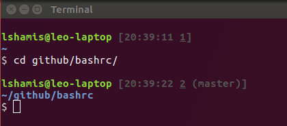
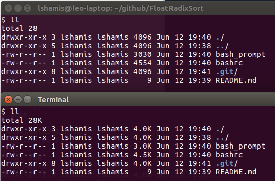
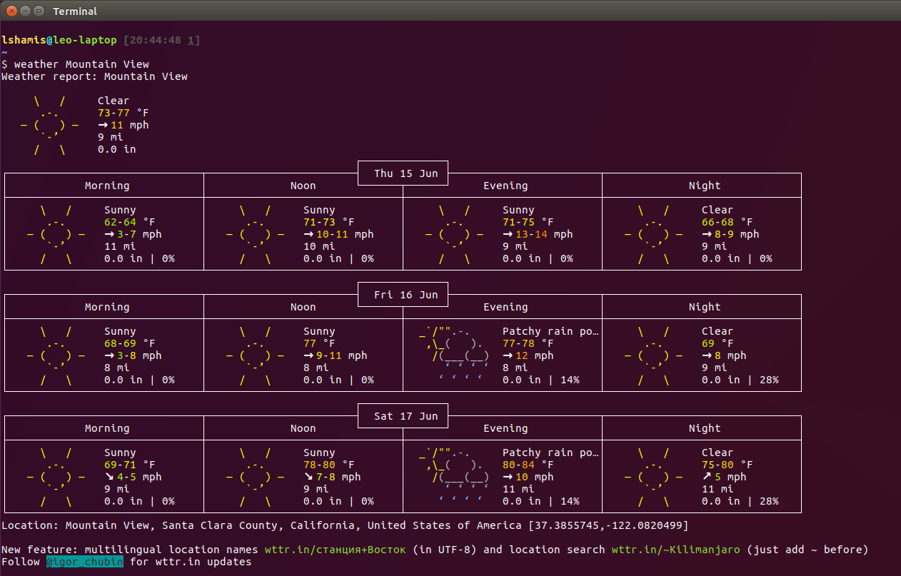

# My BashRC Changes

## Custom prompt:

## Human readable sizes in `ll`:

## Weather (Credit To Igor Chubin):

## Fancy pattern matching [extglob]:

`?(pattern-list)` Matches zero or one occurrence of the given patterns.

`*(pattern-list)` Matches zero or more occurrences of the given patterns.

`+(pattern-list)` Matches one or more occurrences of the given patterns.

`@(pattern-list)` Matches one of the given patterns.

`!(pattern-list)` Matches anything except one of the given patterns.

## Fancy pattern matching [globstar]:
When `**` is used in a pathname expansion context, it will match all files and zero or more directories and subdirectories. If the pattern is followed by a `/`, only directories and subdirectories match.

## Increased history size:
\# of recent command lines saved: increased from `1000` to `100000`.

## myip

Command prints your externally visible IP.

## plz

Let's try that last command again, but with `sudo`.

